# DocSnap

DocSnap captures web evidence, extracts claims with AI, investigates those claims against live web search with an AI-generated verdict, anchors tamper-evident commitments through Flare Confidential Compute, and publishes the result into a public, forkable investigation network.

## Bounty

Bounty 2 — Confidential Compute Apps

## System Architecture

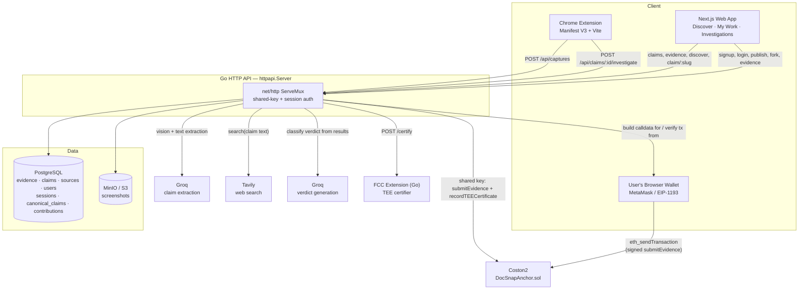

Two independent things get anchored on Coston2, and two independent parties can sign the first one: the **evidence record** (`submitEvidence`, permissionless, records `msg.sender`) and its **TEE certificate** (`recordTEECertificate`, restricted to the TEE reporter key — always server-side, never the user's wallet). See [Bring-Your-Own-Wallet Anchoring](#bring-your-own-wallet-anchoring).

## Data Model

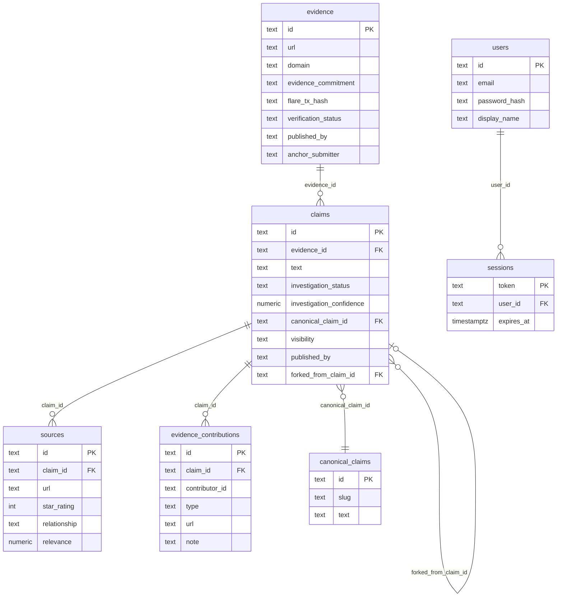

`claims` and `evidence` both carry `published_by` (the owning user, empty for anonymous/extension captures) and a `visibility` on claims (`private` / `unlisted` / `public`) — see [Access Control](#access-control--visibility). `sources` are AI-retrieved during investigation; `evidence_contributions` are human-submitted and deliberately kept in a separate table (see [Community Evidence](#community-evidence-contributions)).

## Evidence Capture & Certification

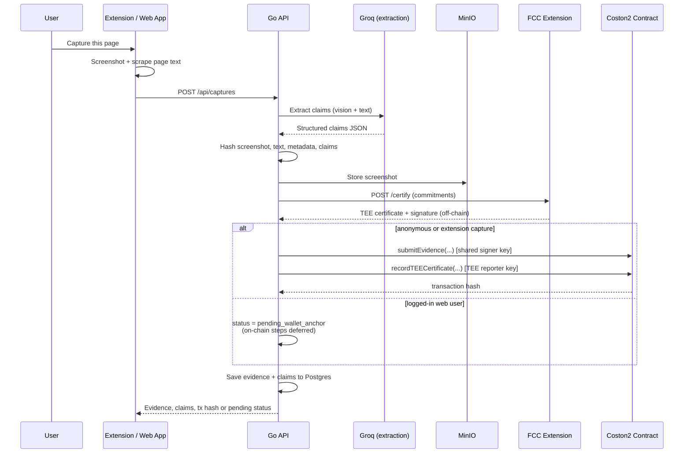

The two on-chain calls only happen immediately for anonymous/extension captures, which have no wallet to ask. A logged-in web user's capture is saved and fully usable right away — investigation, proof-of-capture, everything — it just isn't on Coston2 yet.

## Claim Investigation (Verdict Generation)

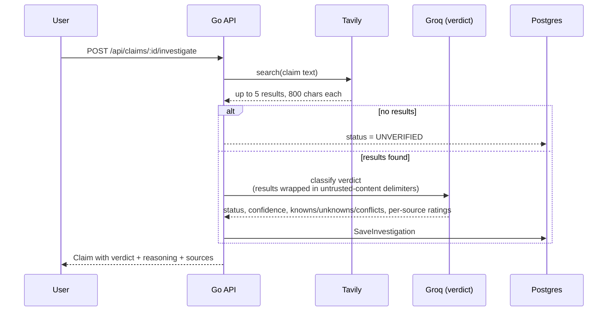

Search results are untrusted, model-facing input — both the extraction and verdict prompts wrap them in explicit `<untrusted-content>` delimiters so a page that says "ignore previous instructions" in its own text can't steer the classifier.

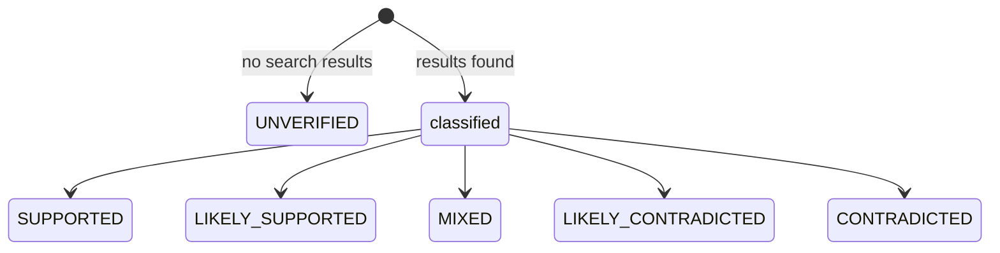

## Evidence Commitment

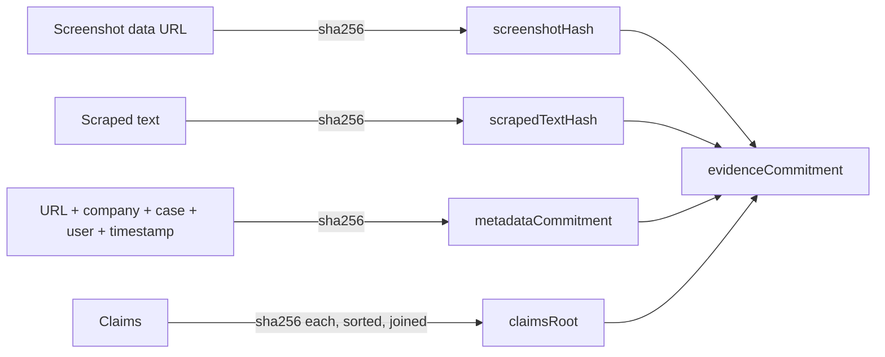

Changing a single byte of the screenshot, text, or any claim changes its hash, which changes `claimsRoot` or `screenshotHash`/`scrapedTextHash`, which changes `evidenceCommitment` — the value anchored on Coston2 and checked on verify.

## Bring-Your-Own-Wallet Anchoring

`submitEvidence()` on `DocSnapAnchor.sol` is permissionless and records `msg.sender` — so no contract change was needed to let a logged-in user sign it themselves instead of the shared server key. The API only ever builds the calldata; it never sees the user's private key.

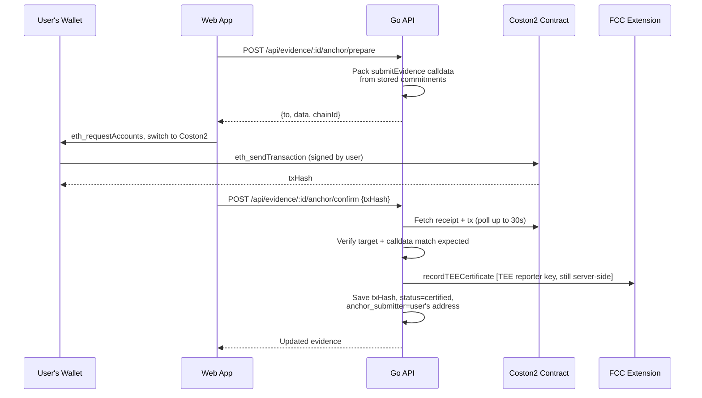

If `confirm` times out on a slow block but the tx lands moments later, re-submitting the same `txHash` is safe — it just re-verifies — so the UI offers a "Recheck status" retry instead of forcing a brand new signature.

## Verification

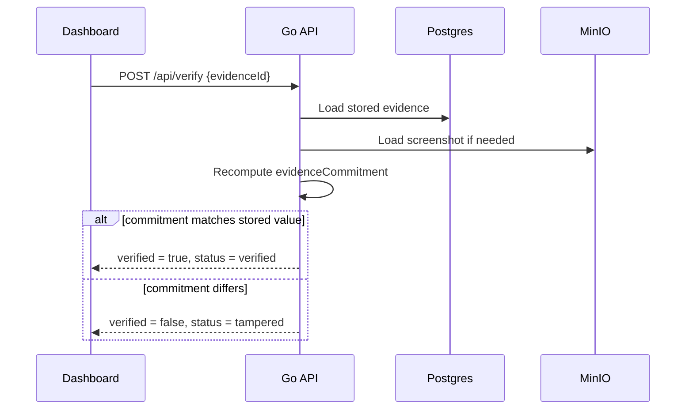

## Accounts & Dual Auth

One `auth()` middleware accepts either credential — the extension's machine key never needs to become a person, and a person never needs an API key:

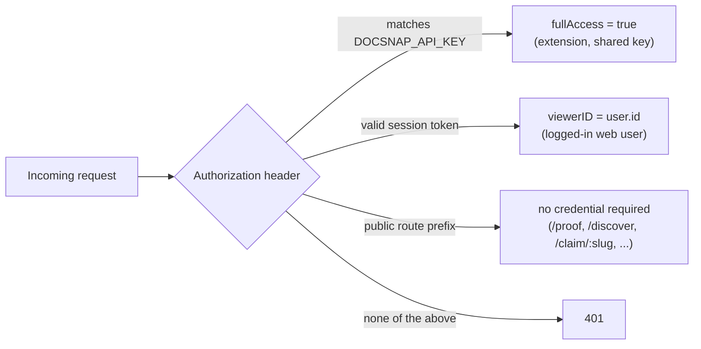

`resolveViewer()` returns `(fullAccess, viewerID)` from that same check — used everywhere a person's identity matters beyond the blanket gate: per-row `canView` for private claims, ownership checks on wallet-anchoring and publish, and scoping `/my-work` search results to the logged-in user's own captures.

## Discovery Network: Publish, Fork & Canonical Claims

A `claims` row already *is* one investigation (one extracted claim, one verdict). `canonical_claims` is a thin grouping row so independent investigations of the same real-world claim — different captures, different researchers, forks — share one public URL instead of a heavier parallel entity.

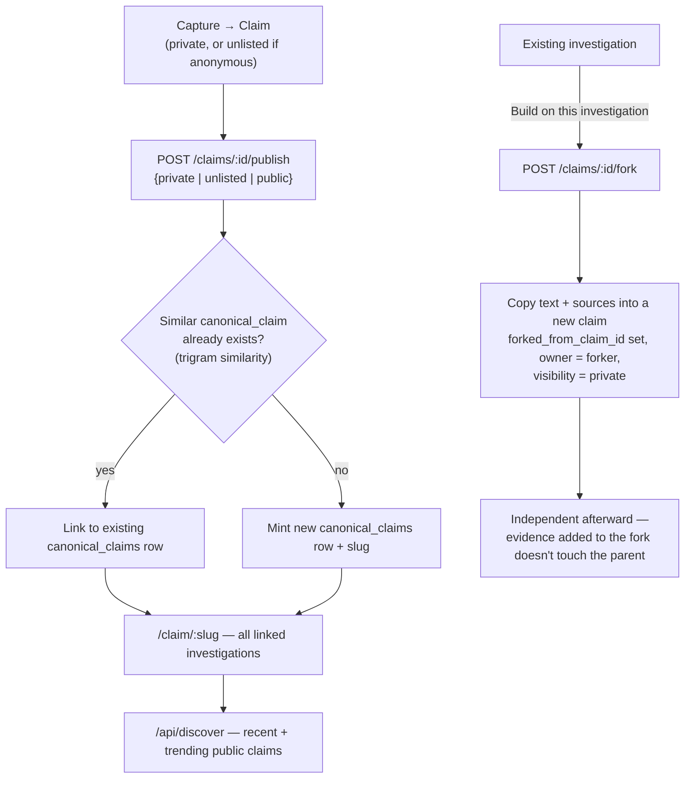

## Community Evidence Contributions

`evidence_contributions` is separate from the AI-retrieved `sources` table — a person, not the verdict pipeline, attaching a URL and a note. Types are `support` / `contradict` / `context` / `correction`; there is deliberately no truth-voting mechanic.

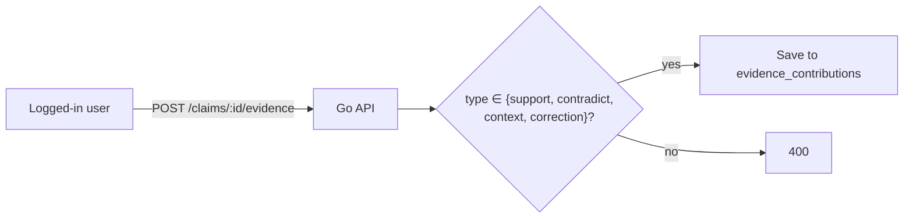

## Domain Trust Signal

A domain isn't "false" — its claims keep getting contradicted. Rolled up from data that already exists; no new table.

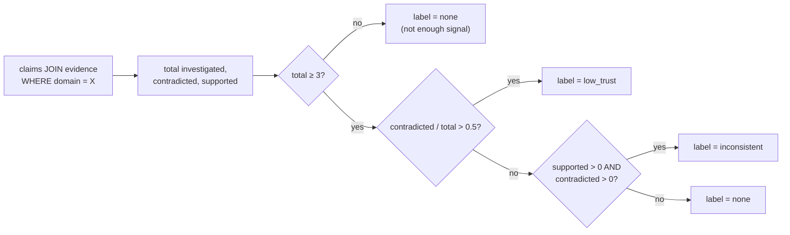

Exposed at `GET /api/domain/:domain/trust`, rendered as a badge wherever a domain already appears — with a per-domain request cache on the frontend so one claims list doesn't fire a duplicate fetch per row.

## Access Control & Visibility

| Visibility | Who can view |
|---|---|
| `private` | The owner only (single account — no team/group sharing) |
| `unlisted` | Anyone with the direct link |
| `public` | Unlisted, plus listed on Discover and search |

Anonymous/extension captures default to `unlisted`, not `private` — an owner-only claim with no owner would be permanently unviewable by anyone, including the person who just captured it.

## API Surface

| Route | Auth | Purpose |
|---|---|---|
| `POST /api/captures` | shared key or session | Capture a page: extract, hash, certify, anchor (or defer to wallet) |
| `GET /api/claims` | shared key or session | Search — scoped to the caller's own captures when logged in |
| `POST /api/claims/:id/investigate` | shared key or session | Run Tavily + Groq verdict generation |
| `GET /api/investigations/:id` | public (per-row `canView`) | One claim's full verdict + sources |
| `GET /api/proof/:id` | public | Evidence commitments + on-chain status, no login |
| `POST /api/auth/signup` `login` `logout` `GET /api/auth/me` | — | Account + session lifecycle |
| `GET /api/discover` `GET /api/search` `GET /api/claims/similar` | public | Network read surface |
| `GET /api/claim/:slug` | public (per-row `canView`) | Canonical claim rollup |
| `POST /api/claims/:id/evidence` `fork` `publish` | session required | Contribute, fork, or publish an investigation |
| `POST /api/evidence/:id/anchor/prepare` `confirm` | session required, owner only | Bring-your-own-wallet anchoring |
| `GET /api/domain/:domain/trust` | public | Domain trust rollup |

## Stack

- Chrome extension: Manifest V3, TypeScript, Vite
- Web app: Next.js, TypeScript, Tailwind CSS
- Backend: Go HTTP API (stdlib `net/http`, `pgx`)
- Database: PostgreSQL with full-text search and trigram indexes
- Storage: MinIO / S3-compatible object storage
- AI: Groq for claim extraction and verdict classification (two distinct models — a reasoning-capable multimodal model for extraction, a plain instruct model for verdict classification), with a local rule-based fallback extractor
- Search: Tavily for live web search backing each investigation
- Blockchain: Solidity contract on Flare Coston2, callable by a shared server key or a user's own wallet
- Confidential compute: Go FCC extension (standalone TEE certifier)
- Wallet: raw EIP-1193 (`window.ethereum`) — no wagmi/viem/ethers dependency

## Local First Run

```bash
docker compose -f infra/docker-compose.yml up -d postgres minio
bun install
bun run dev:api        # Go API on :8080, hot reload via air
bun run dev:web        # Web app on :3000
bun run build:extension && bun run dev:extension
cd fcc/docsnap/go && go run ./cmd/extension  # optional standalone TEE, :8787
```

The API applies its Postgres schema automatically on startup and creates the MinIO bucket if it doesn't exist.

## Required Credentials

Create `.env` from `.env.example`.

- `GROQ_API_KEY`: create an API key in the Groq console at `https://console.groq.com/keys`.
- `GROQ_MODEL`: defaults to `qwen/qwen3.6-27b`, a reasoning-capable multimodal model used for screenshot + text claim extraction.
- `GROQ_VERDICT_MODEL`: defaults to `llama-3.3-70b-versatile` — a plain instruct model, deliberately not the reasoning model above; verdict classification is a tight-latency, tight-token-budget task where a reasoning model's hidden "thinking" tokens blow the free-tier rate limit for no accuracy benefit.
- `TAVILY_API_KEY`: create an API key at `https://tavily.com` — powers the live web search behind every investigation.
- `DOCSNAP_API_KEY`: shared secret for the extension's machine calls (Bearer token). Real people authenticate with session tokens instead — see [Accounts & Dual Auth](#accounts--dual-auth).
- `DOCSNAP_FLARE_PRIVATE_KEY`: private key for a funded Coston2 wallet (the shared/fallback submitter).
- `DOCSNAP_TEE_REPORTER_PRIVATE_KEY`: private key for the contract's TEE reporter account, funded separately — it sends the `recordTEECertificate` transaction, always server-side regardless of who submitted the evidence.
- `DOCSNAP_FLARE_RPC_URL`: defaults to `https://coston2-api.flare.network/ext/C/rpc`.
- `DOCSNAP_CONTRACT_ADDRESS`: deployed `DocSnapAnchor` contract address on Coston2.
- `DOCSNAP_TEE_URL`: FCC extension URL, defaults to `http://localhost:8787`. If empty, the API falls back to an in-process certificate simulator.
- `DOCSNAP_S3_*`: MinIO/S3 endpoint, credentials, and bucket. Defaults match `infra/docker-compose.yml`.
- `DATABASE_URL`: Postgres connection string.

## Contracts

```bash
cd contracts
forge install foundry-rs/forge-std --no-git  # first time only
forge test
DOCSNAP_TEE_REPORTER=0xYourTEEReporterAddress forge script script/DeployDocSnapAnchor.s.sol --rpc-url "$DOCSNAP_FLARE_RPC_URL" --private-key "$DOCSNAP_FLARE_PRIVATE_KEY" --broadcast
```

## FCC Extension

```bash
cd fcc/docsnap/go
go test ./...
go run ./cmd/extension
```

## Before Coston2 Deployment

- Docker daemon running (`docker compose -f infra/docker-compose.yml up -d postgres minio`)
- Foundry installed (`curl -L https://foundry.paradigm.xyz | bash && foundryup`)
- Two funded Coston2 wallets — deployer/submitter and TEE reporter — via `cast wallet new` and the [Coston2 faucet](https://faucet.flare.network)
- `DOCSNAP_FLARE_RPC_URL`, `DOCSNAP_FLARE_PRIVATE_KEY`, `DOCSNAP_TEE_REPORTER_PRIVATE_KEY` set in `.env`
