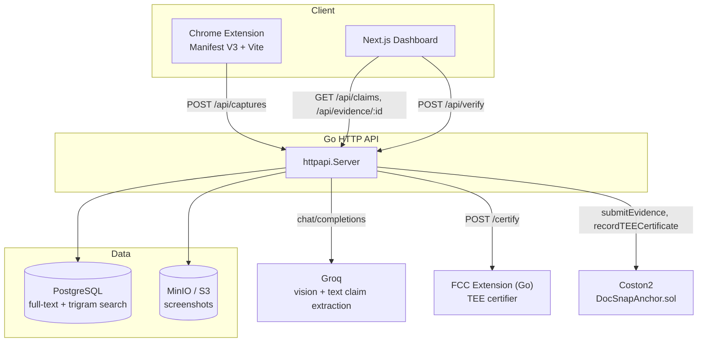
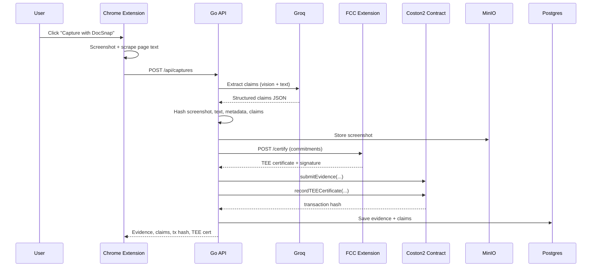
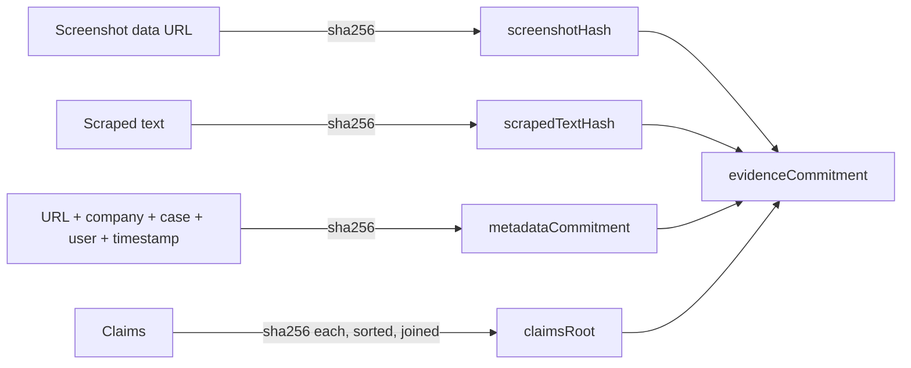
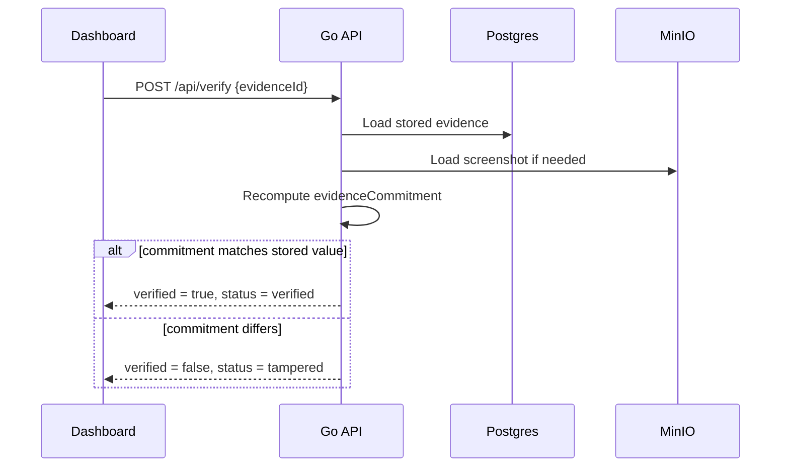

# DocSnap

DocSnap captures web evidence, extracts claims with AI, makes those claims searchable, and anchors tamper-evident commitments through Flare Confidential Compute.

## Bounty

Bounty 2 — Confidential Compute Apps

## Architecture



## End-to-End Capture Flow



## Evidence Commitment



Changing a single byte of the screenshot, text, or any claim changes its hash, which changes `claimsRoot` or `screenshotHash`/`scrapedTextHash`, which changes `evidenceCommitment` — the value anchored on Coston2 and checked on verify.

## Verification



## Stack

- Chrome extension: Manifest V3, TypeScript, Vite
- Dashboard: Next.js, TypeScript, Tailwind CSS
- Backend: Go HTTP API (stdlib `net/http`, `pgx`)
- Database: PostgreSQL with full-text search and trigram indexes
- Storage: MinIO / S3-compatible object storage
- AI: Groq vision/text claim extraction, with a local rule-based fallback extractor
- Blockchain: Solidity contract on Flare Coston2
- Confidential compute: Go FCC extension (standalone TEE certifier)

## Local First Run

```bash
docker compose -f infra/docker-compose.yml up -d postgres minio
bun install
bun run dev:api        # Go API on :8080, hot reload via air
bun run dev:web        # Dashboard on :3000
bun run build:extension && bun run dev:extension
cd fcc/docsnap/go && go run ./cmd/extension  # optional standalone TEE, :8787
```

The API applies its Postgres schema automatically on startup and creates the MinIO bucket if it doesn't exist.

## Required Credentials

Create `.env` from `.env.example`. Detailed setup is in `docs/ENV_SETUP.md`.

- `GROQ_API_KEY`: create an API key in the Groq console at `https://console.groq.com/keys`.
- `GROQ_MODEL`: defaults to `qwen/qwen3.6-27b`, a reasoning-capable multimodal model used for screenshot + text claim extraction.
- `DOCSNAP_FLARE_PRIVATE_KEY`: private key for a funded Coston2 wallet.
- `DOCSNAP_TEE_REPORTER_PRIVATE_KEY`: private key for the contract's TEE reporter account, funded separately — it sends the `recordTEECertificate` transaction.
- `DOCSNAP_FLARE_RPC_URL`: defaults to `https://coston2-api.flare.network/ext/C/rpc`.
- `DOCSNAP_CONTRACT_ADDRESS`: deployed `DocSnapAnchor` contract address on Coston2.
- `DOCSNAP_TEE_URL`: FCC extension URL, defaults to `http://localhost:8787`. If empty, the API falls back to an in-process certificate simulator.
- `DOCSNAP_S3_*`: MinIO/S3 endpoint, credentials, and bucket. Defaults match `infra/docker-compose.yml`.
- `DATABASE_URL`: Postgres connection string.

## Contracts

```bash
cd contracts
forge install foundry-rs/forge-std --no-git  # first time only
forge test
DOCSNAP_TEE_REPORTER=0xYourTEEReporterAddress forge script script/DeployDocSnapAnchor.s.sol --rpc-url "$DOCSNAP_FLARE_RPC_URL" --private-key "$DOCSNAP_FLARE_PRIVATE_KEY" --broadcast
```

## FCC Extension

```bash
cd fcc/docsnap/go
go test ./...
go run ./cmd/extension
```

## Before Coston2 Deployment

- Docker daemon running (`docker compose -f infra/docker-compose.yml up -d postgres minio`)
- Foundry installed (`curl -L https://foundry.paradigm.xyz | bash && foundryup`)
- Two funded Coston2 wallets — deployer/submitter and TEE reporter — via `cast wallet new` and the [Coston2 faucet](https://faucet.flare.network)
- `DOCSNAP_FLARE_RPC_URL`, `DOCSNAP_FLARE_PRIVATE_KEY`, `DOCSNAP_TEE_REPORTER_PRIVATE_KEY` set in `.env`
